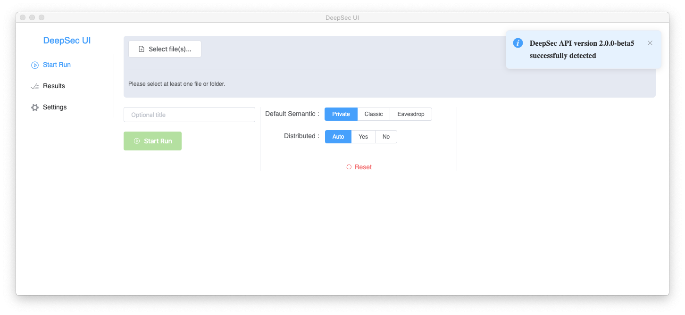
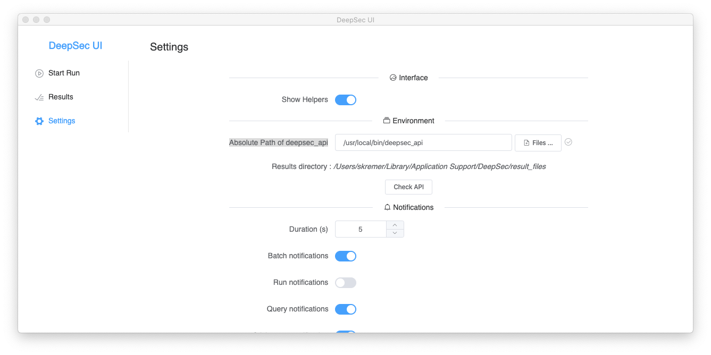
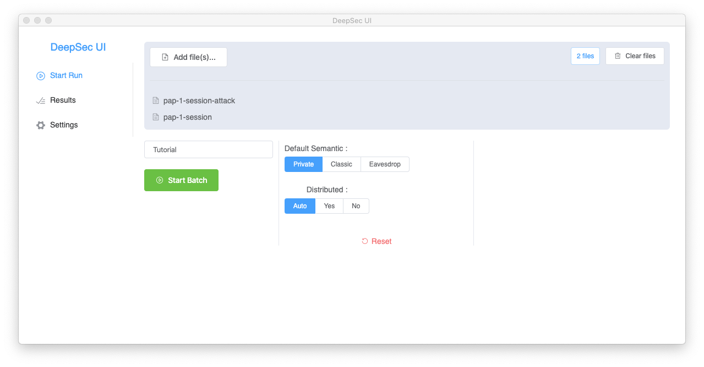
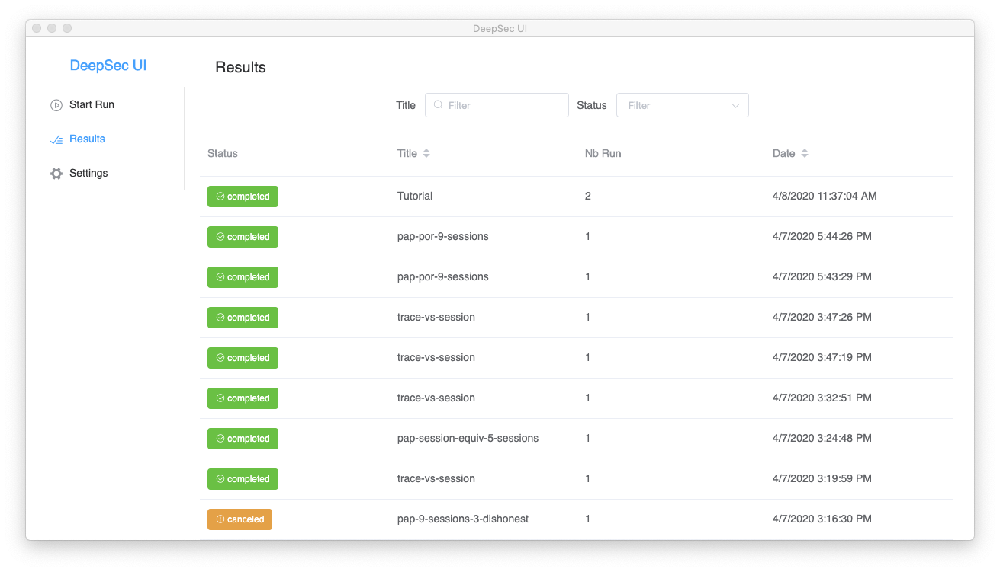
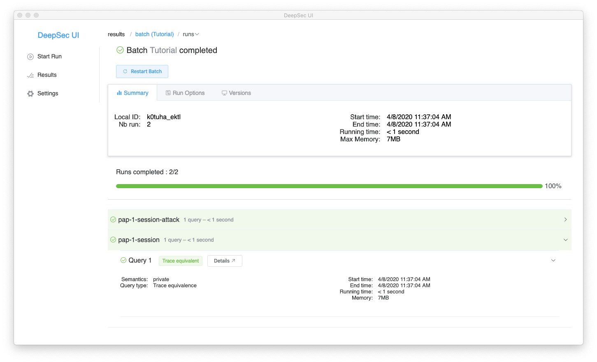
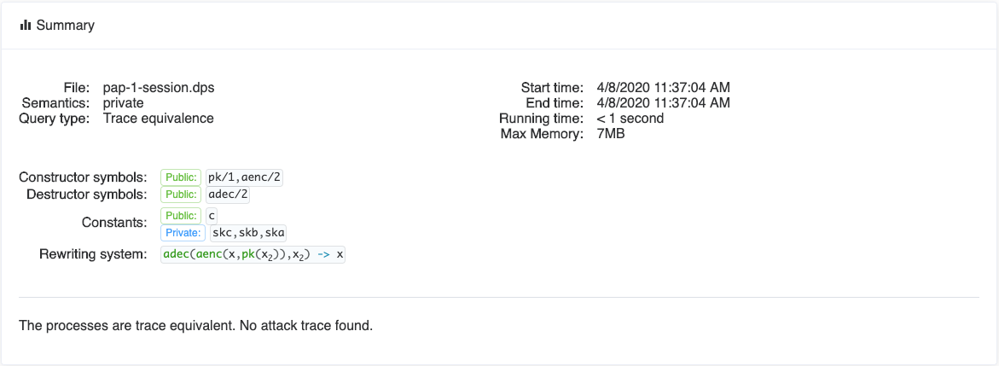
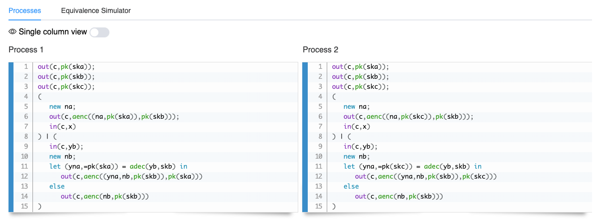
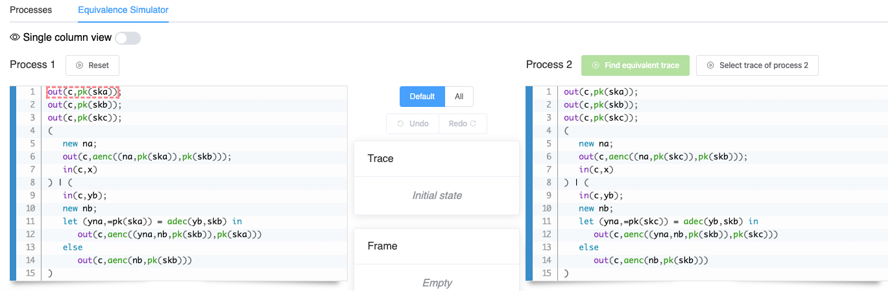

---
  author:
    - name : Vincent Cheval
      webpage : https://members.loria.fr/vcheval
    - name : Steve Kremer
      webpage : https://members.loria.fr/SKremer
    - name : Itsaka Rakotonirina
      webpage : https://members.loria.fr/IRakotonirina

  title: DeepSec prover
  pagetitle: Manual - A small example
  mainpagetitle: Manual of DeepSec

  depth: ../

  navigation: true

  next_page: Advanced options
  next_page_url: html/advanced.html
  prev_page: Installation
  prev_page_url: html/install.html
---

## Tutorial


### The Private Authentication Protocol

We will now explain protocol verification in **DeepSec** through an example.
As **DeepSec** specializes in verifying equivalence properties, mainly used for modelling privacy preserving properties, we will use the *Private Authentication Protocol* (PAP) as our example [@AF-tcs04].
The protocol can be described in "Alice & Bob" notation as follows:

```
  A -> B: aenc( (Na,pk(skA)), pk(skB) )
  B -> A: aenc( (Na,Nb,pk(skB)), pk(skA) )     if B accepts requests from A
          aenc( Nb, pk(skB) )                  otherwise
```

Alice (A) makes a connection request to Bob (B). For this Alice sends the asymmetric encryption (`aenc`) of the pair `(Na,pk(skA)` with Bob's public key (`pk(skB)`).
Here `Na` is a fresh random nonce and `pk(skA)` is Alice's public key.
The term `pk(sk)` denotes the public key corresponding to the private key `sk`.
Bob may accept requests from Alice or not.

The aim of the protocol is to conceal from outside observers whether Bob does accept connections from Alice or not:
this is called _private_ authentication.
If Alice is in the list of connections accepted by Bob, Bob replies with the message `aenc( (Na,Nb,pk(skB)), pk(skB) )`, i.e. the encryption of the tuple `(Na,Nb,pk(skB))` (where `Nb` is a fresh nonce generated by Bob) with Alice's public key `pk(skA)`.
Otherwise, in order to hide the connection refusal, Bob sends a decoy message `aenc( Nb, pk(skB) )`.

The modelling of the PAP protocol in **DeepSec** is available in the
file

```bash
  Examples/tutorial/pap-1-session.dps
```

in the **deepsec** directory.
We suggest that you move to that
directory and make sure that the **deepsec** executable is in your
path.


### Modelling messages in **DeepSec**


As in other symbolic models, protocol messages are modelled as
*terms*.
Therefore the first part of a **DeepSec** file consists in
the necessary declarations.
To model PAP we first declare a few constants.


```{.deepsec}
  free c.
  free ska, skb, skc [private].
```

Here, `c` is a so-called *free* name: free names model public
constants, that are known to the adversary. In PAP `c` will be
a channel name, as we will see below. On the other hand we need to
declare *secret* keys. For this we use *private* names `ska, skb, skc`
that are declared with the additional attribute `[private]`.


Next, we need to declare function symbols to represent asymmetric encryption.

```{.deepsec}
  fun aenc/2.
  fun pk/1.
```

The function symbol `aenc` is declared to be of arity 2 using the
notation `/2`. Public keys are of arity 1, as they are intended to
take a secret key as argument.


> **Note:** *public names _vs_ function symbols of arity 0*
>
> It is possible to declare function symbols of arity 0, e.g. write
> `fun c/0`, or `const c`. This is equivalent to declaring a free name `free c`.


> **Note:** *alternate modelling of secret keys using private function symbols*
>
>In the modelling proposed above, we intend to compute the
>public key by applying the function `pk` to the secret key,
>e.g. `pk(ska)` would be A's public key. An alternate way of modelling
>can be to derive both the public and secret key from an identity: we
>could declare a _private_ function symbol `fun sk/1
>[private].`. Then, `pk(a)` and `sk(a)` represent A's public,
>respectively private, key. Declaring the function symbol `sk` as
>private implies that the attacker cannot apply this function symbol.


Currently, we have declared function symbols `aenc` and `pk`, but
nothing indicates that these functions represent asymmetric
encryption. We will use _rewrite rules_ to give meaning to these
function symbols.

```{.deepsec}
  reduc adec(aenc(x,pk(y)),y) -> x.
```

This rule indicates that an attacker can apply decryption `adec`; if
the keys match (which is required as we use the same variable `y` as
arguments in encryption and decryption) then the result of applying
decryption returns the plaintext `x`.


> **Note**: *constructor-destructor algebras*
>
> You may have noticed that we did not declare the `adec` symbol. This
>is because `adec` is a _destructor_, while declared function symbols
>are _constructors_. Destructors may actually not occur in protocol
>messages: if the above rewrite rule does not succeed the evaluation
>will _fail_. For example, the evaluation of the terms
>`adec(aenc(m,pk(ska)),skb)` and `adec(c,ska)` would both fail.


> **Note**: *deterministic vs randomized encryption*
>
>You may also note that we modelled encryption as a _deterministic_
>function. Of course, a secure encryption scheme needs to be
>randomized, but in this particular example this simplified version is
>sufficient. This means in particular that the attacker can
>distinguish messages `aenc(0,pk(ska))` and `aenc(1,pk(ska))` where
>`0` and `1` are constants as he could simply re-encrypt these
>constants (supposing he knows the public key). It is however easy to
>model asymmetric encryption by adding a random element, making `aenc`
>a ternary function.


> **Note**: *multiple rewrite rules for a single destructor*
>
> Note that if a destructor function require several rewrite rules,
> they should  be defined inside the same reduc. For example:
>
> ```{.deepsec}
>   reduc
>      exists_double(x,x,y) -> ok;
>      exists_double(x,y,x) -> ok;
>      exists_double(y,x,x) -> ok.
>  ```


### Modelling protocols as processes

We now need to model the behaviour of Alice and Bob. One can think of
a protocol as a distributed program. Each local program of this system
will be represented by a _process_.  We can model Alice's role by the
following process `processA`.

```{.deepsec}
  let processA(ska,pkb) =
    new na;
    out(c,aenc((na,pk(ska)),pkb));
    in(c,x).
```

The process has 2 arguments: `ska` is the secret key of the agent running this
process, and `pkb` is the public key of the agent to whom we want to
connect. First, the process generates a fresh random nonce using the command
`new na`. Next, it sends on channel `c` the encryption of the pair `(na,pk(ska))`
encrypted with the recipient's public key `pkb`, as dictated by the
protocol. Finally, the process expects an input, modelled as
`in(c,x)`. Normally, one would expect additional processing of the
input message, which we omit here for simplification.


> **Note** *private names vs new names*
>
>In the above example we use `new na` to create a fresh, private name
>na. This is again equivalent to declaring a free, private name, as we
>did for `ska, skb` and `skb`. However, the `new` construct is useful
>when a different, fresh name should be created in every instance of
>the process: if we execute several instances of `processA` a distinct
>fresh name `na` is created in each copy.


Next, we model Bob's behaviour by the process `processB`.


```{.deepsec}
  let processB(skb,pka) =
    in(c,yb);
    new nb;
    let (yna,=pka) = adec(yb,skb) in
      out(c,aenc((yna,nb,pk(skb)),pka))
    else out(c,aenc(nb,pk(skb))).
```

This process introduces several new constructs that require
explanations. The first action of the process is to input a message on
channel `c` through the instruction `in(c,yb)`. As a consequence the
message that is received will be bound to the variable `yb`. While the
expected message is `aenc((na,pka)),pk(skb))` we need to keep in mind
that this message may actually be provided by the attacker and may be
an arbitrary message the attacker is able to forge. Therefore we need
to _parse_ the message and perform a number of tests. All of this is
done here in a condensed form using a `let` instruction. We first
decrypt (apply `adec`) the received message (referred to by the
variable `yb`) with the secret key `skb`. Note that if decryption
fails, we will enter the `else` branch of the `let` instruction. Next,
we check that the results is a pair: the first element of the pair is
bound to the variable `yna` and we check that the second variable of
the pair equals the public key `pka`, i.e., the public key of a person
we accept connections from. An expanded form could be written as
follows.

```{.deepsec}
   let yplain = adec(yb,skb) in
      let (yna,ypka) = yplain in
         if ypka = pka then
            out(cb,aenc((yna,nb,pk(skb)),pka))
         else out(cb,aenc(nb,pk(skb)));
      else out(cb,aenc(nb,pk(skb)));
   else out(cb,aenc(nb,pk(skb))).
```

This form is however rather lengthy and requires duplicating else
branches, which is why the above syntactic sugar is often convenient.

> **Note:** *tuples in **DeepSec** *
>
> We have seen in the above example that we used notations `(a,b)` and
> `(a,b,c)` for tuples without explicitly declaring function symbols
> for pairs and triples. Actually, **DeepSec** has built-in support
> for tuples. For each tuple of arity $n$ occurring in the processes
> **DeepSec** will define the constructor `(_, ... ,_)` of arity n
> and corresponding destructors `reduc proj_i_n (x1, ... ,xi, ..., xn)
> = xi` (for all $1\leq i \leq n$). These destructors are used
> implicitly in the let instruction for projecting the elements of the
> tuple.


Finally, we put all the pieces together ia main process `ProcessAB`
modelling the entire system.

```{.deepsec}
  let ProcessAB =
    out(c,pk(ska));
    out(c,pk(skb));
    out(c,pk(skc));
    (
      processA(ska,pk(skb)) | processB(skb,pk(ska))
    ).
```

The system first outputs the public keys, so that they become known to
the attacker. Then the system indicates that processes `processA` and
`processB` are executed in parallel (each with its parameters).

### Verifying private authentication

We are now interested in modelling anonymity. Anonymity is generally
modelled as the indistinguishability of two systems. We therefore
define a second system `ProcessCB`.

```{.deepsec}
  let ProcessCB =
    out(c,pk(ska));
    out(c,pk(skb));
    out(c,pk(skc));
    (
      processA(skc,pk(skb)) | processB(skb,pk(skc))
    ).
```

The difference with previous system `ProcessAB` is the parameter
`skc`, rather than `ska`, given to `processA` and `processB`. Hence,
`ProcessAB` models the situation where B is willing to receive
connections only from A, while in `ProcessCB`, B accepts connections
only from C. The goal of private authentication is to hide from whom
connections are accepted. Indistinguishability can be modelled by
trace equivalence. We can therefore query **DeepSec** to check trace
equivalence between these two systems.


```{.deepsec}
  query trace_equiv(ProcessAB,ProcessCB).
```

To verify this query we use the command

```bash
  $ deepsec pap-1-session.dps
```


**DeepSec** will indeed confirm that this kind of anonymity is satisfied
by outputting (among some other messages) that

```bash
  Result query 1: The two processes are trace equivalent.
```

Looking at the protocol this is intuitively possible thanks to the decoy message
sent in the `else` branch of `processB`.
What happens when we remove the decoy message?
For this we simply replace the else branch with `else 0` (or, equivalently, omit it completely), see the file `PrivateAuthentication-1session-attack.dps`.
We can now run **DeepSec** on this modified file.

```bash
  $ deepsec pap-1-session-attack.dps
```

This time, **DeepSec** will report an attack:

```bash
  Result query 1: The two processes are not trace equivalent.
```

Indeed, when the attacker sends the message
`aenc((n,pk(ska)),pk(skb))` to B, only the first system will send a
reply.

> **Note:** *multiple input files*
>
> **DeepSec** can take several files as input. For example you may run
>
> ```.bash
>   deepsec pap-1-session.dps pap-1-session-attack.dps
> ```


### More complex scenarios and scaling up


In the previous section we considered a very simple scenario and
our verification checked whether private authentication holds when we
have one instance of `A` and `B`. Often, protocols may be secure when
considering a single session, but attacks may arise when multiple
sessions are executed in parallel.

Let us see what happens when we consider two instances of each role
resulting into the following declarations.

```{.deepsec}
  let ProcessAB =
    out(c,pk(ska));
    out(c,pk(skb));
    out(c,pk(skc));
    (
      processA(ska,pk(skb)) | processB(skb,pk(ska)) | // B expects to talk to A
      processA(ska,pk(skb)) | processB(skb,pk(ska))   // B expects to talk to A
    ).

  let ProcessCB =
    out(c,pk(ska));
    out(c,pk(skb));
    out(c,pk(skc));
    (
      processA(skc,pk(skb)) | processB(skb,pk(skc)) | // B expects to talk to C
      processA(ska,pk(skb)) | processB(skb,pk(ska))   // B expects to talk to A
    ).
```

> **Note:** *bounded replication*
>
> When considering multiple sessions it is common to put in parallel
> several identical instances. For example, the process `ProcessAB`
> duplicates `processA(ska,pk(skb))` and
> `processB(skb,pk(ska))`. In more complex scenarios we may want to
> copy more processes a large number of times. Therefore **DeepSec**
> provides a convenient operator `!^n`: `!^n P` is syntactic sugar for
> `n` parallel copies of $P$ where `n` is a positive integer. In the
> above example
>
> ```{.deepsec}
>    processA(ska,pk(skb)) | processB(skb,pk(ska)) |
>    processA(ska,pk(skb)) | processB(skb,pk(ska))
>  ```
>
> could have been replaced by
>
> ```{.deepsec}
>    !^2 processA(ska,pk(skb)) | !^2 processB(skb,pk(ska))
>  ```


We can run

```bash
  $ deepsec pap-2-session.dps
```

and observe that still no attack is found. However, the verification
time increases: while the result is instantaneous for 1 session it now
takes several seconds on a standard laptop. This is due to the fact
that **DeepSec** has to explore **all** possible interleavings, whose
number is exponential.

While the verification time is still moderate for 2 sessions this is
not the case anymore when we add a third session.

```bash
  $ deepsec pap-3-session.dps
```

will take _much_ longer. How can we ensure that the protocol cannot be
attacked with 3 sessions, or more?

#### Acceleration technique 1: **distributing the computation**

A first way to scale up is to distribute the computation.  By default,
**DeepSec** checks how many physical cores your machine has and
distributes the computation on these cores by creating the same amount
of _workers_. To activate the distributed computation with a different
number of workers, `deepsec` should be run with the option `-l n` (or
`--local_workers n`) where `n` is the number of desired local
workers.

It is also possible to distribute computation on several machines. To
do so, deepsec requires an ssh connexion between the localhost and the
distant machine, using ssh key authentication, so that no password is
required. The computation on a distant machine is configured with the
command line option `-w <host> <path> <n>` (or `--distant_workers
<host> <path> <n>`). The parameter `<host>` is the ssh login and
address (e.g my_login@my_host). The parameter `<path>` should indicate
the path to the deepsec directory on the distant machine. Finally, the
parameter `<n>` represents the number of cores that should be
dedicated by this distant machine to the computation of the input
file.

Note that the option `-distant_workers` must be used for each distant
machine.

```.bash
deepsec -w login1@host1 tools/deepsec 15 \
	    -w login2@host2 deepsec auto my_file.dps
```

In this command line, the first machine should be accessible with `ssh
login1@host1` and the **deepsec** directory should be located at
`~/tools/deepsec` on this machine. Similarly, the second machine
should be accessible with `ssh login2@host1` and the **DeepSec**
directory should be located at `~/deepsec`. If the connexions to both
machines are successful, **DeepSec** will distribute the computation
between the local and the 2 distant machines: 15 cores are used on the
first machine and, by specifying `auto`, all available physical cores
on the second machine.

> **_Important_**: The localhost and distant machines must have
> exactly the  same version of **DeepSec** (the Git hash is displayed
> when running `deepsec` without parameters or with the option
> `--help`), compiled with the same version of **OCaml**.


#### Acceleration technique 2: **session equivalence**

Distribution of the computation may gain a constant speed-up factor:
going from a 20 hours computation to a 1 hour computation is indeed
much appreciated, but may not solve the more fundamental problem of
the exponential blowup.


This is why **DeepSec** proposes another, more efficient proof
technique.
The underlying idea is to prove a *finer* equivalence
relation, that we call _equivalence by session_.
This equivalence significantly decreases the number of interleavings by exploiting the *structure* of the processes.
Indeed, often, we want to show the equivalence of processes that are of the form

```{.deepsec}
  let P = P1 | ... | Pn
  let Q = Q1 | ... | Qn
```

The rough idea of equivalence by sessions is to match parallel
sessions rather than individual actions.
Here, for instance, one may try to match all actions of `P1` by all actions of say `Q3`, all actions of `P2` by all actions of `Q1`, etc. **DeepSec** still needs to explore all possible such matches, but their number is often lower by an exponential factor compared to the number of all possibles matches of actions.
Besides, this equivalence allows many more optimisations than the initial trace equivalence (see *Partial order techniques* below).

For example, we may try to verify a complex scenario with 5 sessions
on PAP.

```.bash
  $ deepsec pap-session-equiv-5-sessions.dps
```

Now this computation terminates in about a minute on a standard laptop
(with two cores).
Distributing this computation could of course improve further the verification time.


> **Note:** *Equivalence by session and false attacks*
>
> Why shouldn't one always use the more efficient equivalence by session ?
>As explained above equivalence by session is a stronger equivalence
>than trace equivalence. Therefore whenever equivalence by session is
>satisfied, trace equivalence also holds, but the converse may not
>be true. Therefore equivalence by session may lead to a _false attack_
>(with respect to trace equivalence). This is witnessed by the
>following small example
>
> ```{.deepsec}
>   let P = out(c,a) ; out(c,a).
>   let Q = out(c,a) | out(c,a).
>	query trace_equiv(P,Q).
>	query session_equiv(P,Q).
>  ```
> and can be tested using **DeepSec**.
>
> ```.bash
>    $ deepsec trace-vs-session.dps
>  ```


> **Note:** *Syntactic restriction*
>
> The theory of equivalence by session requires that all channels are
> only (public or private) names or constants, i.e., no complex terms, nor variables.


#### Acceleration technique 3: **Partial-order reduction techniques**

Probably the most effective way to fight state explosion are partial
order reduction (POR) techniques.
**Deepsec** implements powerful POR optimisations, that were designed in [@BDH-concur15] for accelerating the decision of trace equivalence.
These techniques are however only sound on a class of _action-determinate_ processes:
a process is action determinate when it never can reach a state where two outputs, or two inputs on a same channel are executable.
Moreover, the processes may not use _private_ channels.
A simple, sufficient criterion is to check that syntactically no outputs on a same channel appear in parallel, and similarly for inputs, and that all channels are public.
**Deepsec** automatically checks this criterion, and when satisfied applies POR techniques.

A pragmatic way to ensure action determinacy is to use a different
channel name for each process in parallel.
It is easy to modify the specification of PAP in that way.
This modelling allows for a spectacular efficiency gain.
The verification of a scenario with 9 sessions terminates in a few seconds.

```.bash
  $ deepsec pap-por-9-sessions.dps
```

Again, one may wonder why one should not always use different channel
names for parallel processes?
Intuitively, using different channels for parallel sessions allows the attacker to identify the session that has sent the message.
While this works well for the PAP protocol, some protocols precisely rely on this _sender ambiguity_ to ensure some form of anonymity.

> **Note:** *POR, determinate processes and equivalence by session*
>
> As explained above, for proving trace equivalence, the partial-order reductions of **DeepSec** are only sound for the class of determinate processes.
> The situation is actually simpler for equivalence by session, for which these POR are sound for *any* process [@CKR-ccs19].
> However, as witnesses by the examples provided so far in this tutorial, proving trace equivalence of determinate processes is significantly faster than proving equivalence by session of two non-determinate processes.
>
> Note that combining the two acceleration techniques (i.e. proving the equivalence by session of determinate processes) does not further improve the performances.
> It is indeed proved in [@CKR-ccs19] that trace equivalence and equivalence by session coincide for determinate processes, and **DeepSec** therefore uses the same algorithm for both equivalences when determinacy is detected.


### The **DeepSec** User Interface

**DeepSec** also comes with a graphical user interface (GUI).
The GUI is intended to provide an easy to use environment for using **DeepSec**, browsing the results and simulating attacks as well as equivalence proofs.


The GUI is launched by executing the **DeepSec UI** application.
This is a standalone application that communicates with **DeepSec** by making calls to the **deepsec_api** executable.
Therefore, you should make sure that this executable is in your system path.
(Otherwise we can manually configure the path to **deepsec_api**, see below).

When launching **DeepSec UI** you should arrive at the following welcome screen.


\

From this screen you can navigate through the 3 main sections of the
GUI (displayed on the left):
* Start Run
* Results
* Settings

Normally you should see a "pop-up" confirming that  **deepsec_api**
has been successfully detected. If not you will get a _warning_
pop-up. This notification only appears for a few second. If the
executable was not detected you may manually specify the path by
clicking on _Settings_ and providing the _Absolute Path of deepsec\_api_.

\

You may test that the executable is indeed available in the specified
path by clicking on _Check API_.

We can now navigate back to the _Start Run_ section and select the
files with the specifications to be analysed. Let us select the
`pap-1-session` and `pap-1-session-attack` that we used previously
(available in `Examples/tutorial/` in the **DeepSec** folder). The GUI
allows you to select multiple files and such a collection of files is
called a _batch_. Each file of this _batch_ is called a _run_ and such
a run may contain multiple _queries_, as several queries may be
specified in a same file.

In order to reference this batch we may provide a title,
e.g. `Tutorial`. The `Start Run` section also allows for more advanced
settings (_Semantics_, _Distributed_), but we currently keep the
default settings.

\

We can now start the verification by clicking on the _Start Batch_
button. Pop-up windows will notify about the status of the
verification.

Navigating to the results section we now see the list of all previous
verifications including the _Tutorial_ batch.

\

Clicking on the tutorial batch we can display additional
information. You may inspect the Run options and Versions to see the
precise parameters and software versions used to run this batch.

Clicking on `pap-1-session` and then `Query 1` allows to reveal
additional information about the individual run and query.

\

We can now inspect the _Details_ of `Query 1`. The first part of the
screen provides a summary of the query, recalling the declarations of
the file and showing the result of the verification.

\

The second part shows the two processes of the query.

\

We may note that all processes defined by a `let ... = ...` construct
have been inlined. An interesting functionality here is the
_Equivalence Simulator_ (click above the processes): it allows to
define a trace on one process and have **DeepSec** find the equivalent
trace on the other process. "Playing around" with the processes should
allow the user to understand _why_ the two processes are equivalent.

For instance, we could select a trace on Process 1. Available choices
are highlighted and the user may select one of them.

\

Initially, a single action `out(c,pk(ska));` is available and there is
no other choice than select this one. This is a direct communication
with the attacker on a channel; hence, the attacker needs to provide a
_recipe_ to compute this channel name. As here it is a constant `c`
the tool proposes the recipe and we can simply validate. The three
first actions do not offer any choice, and we can select the trace

```{.deepsec}
  out(c,ax1) · out(c,ax2) · out(c,ax3)
```

resulting into the _frame_ (which is the sequence of messages observed by an attacker spying on the communication network):

```{.deepsec}
  ax1 -> pk(ska) · ax2 -> pk(skb) · ax3 -> pk(skc)
```

Next we have the choice between two actions
`out(c,aenc((na,pk(ska)),pk(skb)))` and `in(c,yb)`. Let us first
select the output and then the input `in(c,yb)`. Here we need to
provide the _recipe_ for the value to input (click on the "pencil").
Let's say we want simply to forward the last output -- the recipe for
this is the last element of the frame and we may indicate `ax_4`. We
see that this input satisfies the test in the `let` construct. Now we
can select the output `out(c,aenc((yna,nb,pk(skb)),pk(ska)))` and
require the tool to _Find equivalent trace_ (above Process 2).

We can now "walk through" the equivalent trace using the `<Prev` and
`Next>` buttons.
We see that this results into a statically equivalent frame (i.e. a frame that is indistinguishable from the previous one for an outside observer).

You may also try to see what happens if you use a different recipe for
`in(c,yb)`:

```
  aenc((#n,ax_1),ax_2)
```

In this recipe the attacker encrypts himself a fresh name `#n` of his
own (fresh names are prefixed by `#`) and `pk(a)` (specified by
`ax_1`) with the `pk(c)` (specified by `ax_3`). While this results in
the same message as `ax_4` `aenc((yna,nb,pk(skb)),pk(ska))` in process
1 this is not the case in process 2. Indeed, when requesting to vind
an equivalent trace we see that process 2 will move into the `else`
branch and send the decoy message `aenc(nb,pk(skb))`. Nevertheless,
the two resulting frames are statically equivalent.
